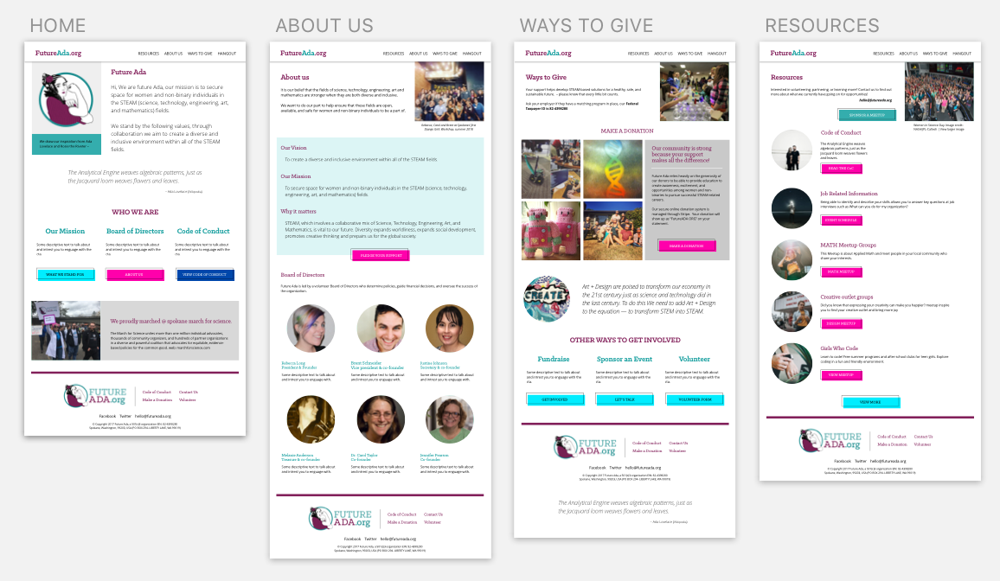

This project was bootstrapped with [Create React App](https://github.com/facebookincubator/create-react-app).

# Project Codename: Future Ada
Future Ada is a non-profit startup, focusing on Securing space for women and non-binary individuals in the STEAM fields.

### 📝 Wireframes

★ [View high-fidelity composition on InVision](https://invis.io/BRKX7C0U4GS#/303030945_HOME)

### 🐙 Dependencies
* Create React APP using `npm install -g create-ceact-app`
* [react-twitter-widgets](https://www.npmjs.com/package/react-twitter-widgets) 
 using `npm install --save react-twitter-widgets`
* [bulma](https://www.npmjs.com/package/react-bulma-components)

### 🦉 Task List

A list of tasks that need to be completed for your project.
- [x] Setup `create-react-app` scaffold add BrowserRouter 
- [x] Render React state
- [x] Design Wireframe layout
- [x] Develop Content for pages
- [x] Create design patterns html css (using Bulma)
- [x] Develop page components
- [x] Pull twitter news feed
- [ ] Setup VPS environment
- [ ] Deploy to server via git